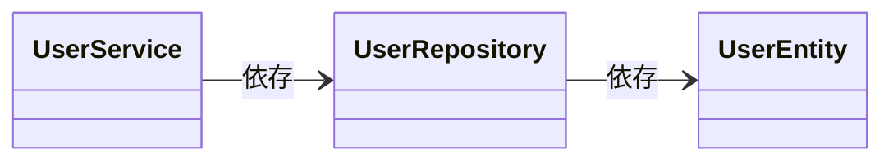
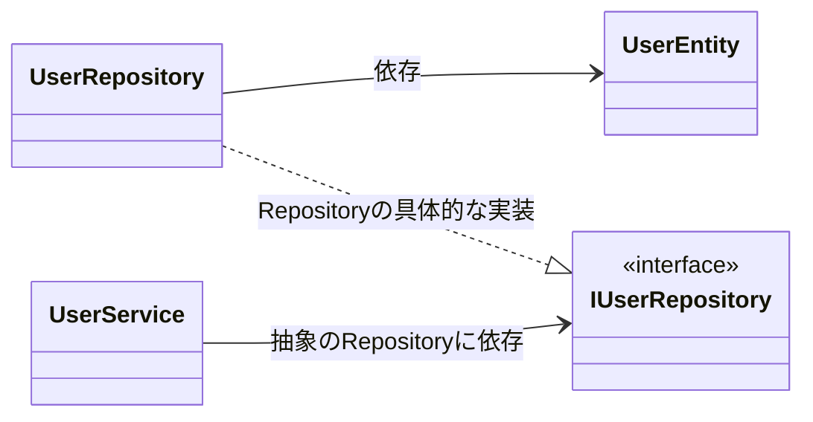

# 概要

このレポジトリは、ブログ記事「[テストコードを書きやすくするテクニック（DI, 抽象に依存, 依存性逆転の原則）](https://tsuyopon.xyz/2024/04/03/writing-testable-code-with-di/)」の補足説明用として作成したものになります。

## 構成

このレポジトリで見ていただきたいポイントは以下の通りです。

- UserEntity, UserRepository, UserService の各クラスの関係
- どのような手順で実装を進めているか
- UserService と UserRepository を抽象に依存させている点

## UserEntity, UserRepository, UserService の各クラスの関係

各クラスの関係図は以下の通りです。

## どのような手順で実装をすすめているか

Entity, Repository, Service の順番で実装を進めました。

実際に開発を進めた時の詳細は[クローズされたプルリクエスト](https://github.com/tsuyopon-xyz/writing-testable-code-with-di/pulls?q=is%3Apr+is%3Aclosed)を参考にしていただけたらと思います。

プルリクエストを確認していただくと、以下の順番で実装が進められているのが確認できるかと思います。

- UserEntity の実装 (#1)
- UserRepository の実装 (#2)
- UserService の実装 (#3)

この実装した順番には意味があり、他クラスへの依存が少ないものから実装を進めています。

具体例を挙げると、UserEntity, UserRepository, UserService が主に依存するクラスは次の通りです。

- UserEntity : 依存なし
- UserRepository : UserEntity に依存する
- UserService : UserRepository に依存する

このような依存関係を持っているので、Entity, Repository, Service の順番で実装した流れとなります。

もう少し思考プロセスを具体的に話すと以下のような流れで考えています。

1. UserService を実装するには UserRepository が先に必要だよね
2. UserRepository を実装するには UserEntity が先に必要だよね
3. UserEntity は特に依存するものがないから、最初に作り始めても問題ないよね

## UserService と UserRepository を抽象に依存させている点

冒頭の各クラスの関係を以下の図のように表しました。

ただ、厳密に言うとこの図は実際の実装とは異なっていて、UserService と UserRepository は、抽象 Repository である IRepository インターフェイスに依存しています。

このような依存関係にしている理由は、一言でいうと「テストを書きやすくするため」です。

こうすることで、なぜテストが書きやすくなるかについては以下を参照していただけたらと思います。

- [ブログ記事](https://tsuyopon.xyz/2024/04/03/writing-testable-code-with-di/)
- レポジトリのコード中のコメント
  - UserService.ts のコメント([8~17 行目](https://github.com/tsuyopon-xyz/writing-testable-code-with-di/pull/3/files?diff=unified&w=0#diff-1af2c86fc5dff1c4571a511882146b8e12f231731928349c79850d0ffd1fa48dR8-R17))
  - BadUserService.ts のコメント([8~14 行目](https://github.com/tsuyopon-xyz/writing-testable-code-with-di/pull/3/files?diff=unified&w=0#diff-fba004c92d837590cd9901a65576f060dca00bf7f75e3321da48c81649e37dcdR8-R14))
  - UserService.test.ts([6~9 行目](https://github.com/tsuyopon-xyz/writing-testable-code-with-di/pull/3/files?diff=unified&w=0#diff-5240dfbc936393c744213402b860c80e07262f25bce89340421821dc044c0686R6-R9))

## 質問, 相談したいあ場合

[このページ](https://tsuyopon.xyz/lp/mail-magazine/)にある LINE 公式アカウントからご連絡いただけたらと思います。
